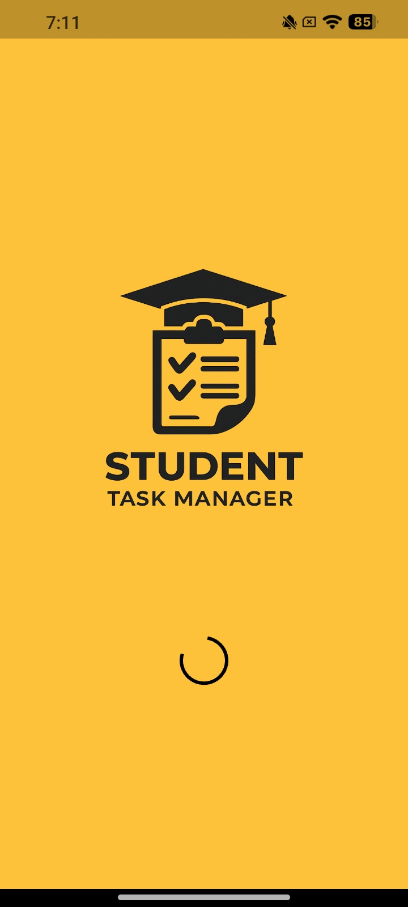
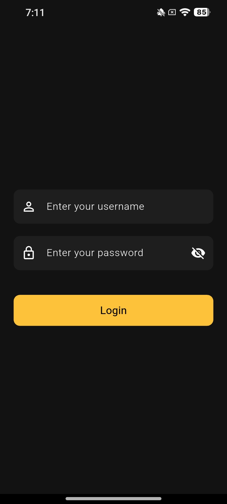
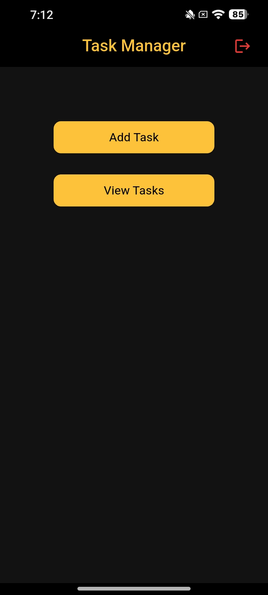
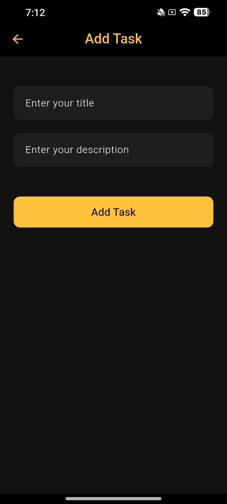
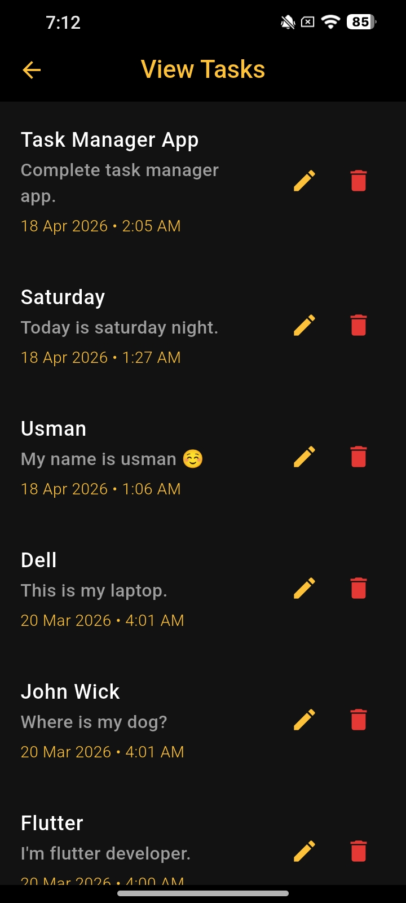

# Student Task Manager App

A Flutter app for managing student tasks with Firebase integration.

## Features
- 🔐 Login with REST API
- 🚪 Logout with confirmation dialog
- ➕ Add Tasks
- ✏️ Edit Tasks with dialog
- 🗑️ Delete Tasks with undo option
- 📋 View Tasks with Date & Time
- 🔄 Real-time updates with Firebase Firestore
- 📱 Responsive UI (Mobile + Tablet)
  
## Screenshots

## Tech Stack
- Flutter & Dart
- Firebase Cloud Firestore
- REST API (DummyJSON)
- Shared Preferences
- Android

## Screens
- Splash Screen
- Login Screen
- Home Screen
- Add Task Screen
- View Tasks Screen
  
## How to Run
1. Clone the repo
2. Run `flutter pub get`
3. Add your `google-services.json`
4. Run `flutter run`

## Test Credentials
- Username: `emilys`
- Password: `emilyspass`

- Add Task Screen
- 
